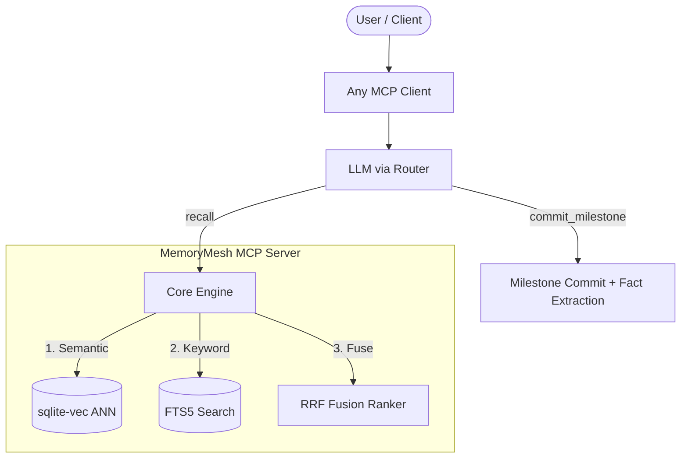

<p align="center">
  <a href="README.md"></a>
  <a href="README.vi.md"></a>
</p>

# MemoryMesh

<p align="center">
  
  
  
  
</p>

**Local-first persistent memory MCP server for AI agents.**
Hybrid search (vector + FTS5) in a single SQLite database, cross-session recall via MCP tools.

## Quick Start

```bash
# Clone & enter
git clone https://github.com/staavanothanh/MemoryMesh.git
cd MemoryMesh

# Create venv & install
python -m venv .venv
source .venv/bin/activate        # Linux/macOS
# .venv\Scripts\activate         # Windows

pip install -e ".[test]"         # install with test deps
python -m memorymesh init        # one-command setup (creates .env, MCP config)

# Start OpenCode — MCP server auto-launches
opencode
```

Or step by step:

```bash
pip install -e ".[test]"
cp .env.example .env             # configure your LLM endpoint
python -m memorymesh             # start standalone MCP server
```

> [!NOTE]
> On the very first run, MemoryMesh will automatically download the `sentence-transformers` embedding model (~100–300 MB) to your local cache. This may take 1–2 minutes depending on your network connection.

## Architecture



**Key design:**
- Session context starts empty; LLM calls `recall` on demand (dynamic recall)
- Single SQLite DB with sqlite-vec for vector search + FTS5 for keyword
- Background tasks (enrichment, consolidation, fact extraction) are rate-limited
- Session-level memories auto-expire after 7 days

### Hidden Gems (Under the Hood)
MemoryMesh is packed with subtle architectural decisions designed to make the AI feel more like a human colleague:
- **Zero-Latency Context (Optimistic Hydration):** Instead of making you wait for vector searches when you reopen an old project, MemoryMesh pre-computes semantic anchors right before a session closes. These are stored in a RAM Cache, meaning the AI regains full context of your last session in `<5ms`—before you even finish typing your first prompt.
- **Cross-Project Wisdom (Soft Penalty):** MemoryMesh doesn't use hard boundaries between projects. It uses a *Soft Penalty* system. If you solve a complex Docker bug in `Project A` and later ask a Docker question in `Project B`, MemoryMesh slightly penalizes `Project A`'s memories but still surfaces them if they are highly relevant. The AI learns globally but prioritizes locally.
- **3-Tier Fallback Retrieval:** Vector databases are great for semantics but terrible at finding specific variable names or UUIDs. MemoryMesh never relies solely on vectors. It cascades through 3 tiers:
  1. *Semantic Search* (sqlite-vec)
  2. *Full-Text Search* (FTS5 keyword matching)
  3. *Chronological Scan* (recent logs)
  This ensures zero "hallucinations from amnesia" — if the data is there, it will be found.

## Cost Management & Dual-LLM Architecture

MemoryMesh uses **two independent LLM layers** to separate interactive performance from background cost:

| Layer | Variable | Typical Models | Purpose |
|-------|----------|----------------|---------|
| **Foreground (Chat)** | `DEFAULT_MODEL` / `FALLBACK_MODEL` | GPT-5.5, Claude 4.7 Opus, Gemini 3.5 Flash, DeepSeek V4-Pro | Direct user interaction via the MCP client |
| **Background (Data)** | `BACKGROUND_MODEL_POOL` | Gemini 2.5 Flash, Llama 3.1 8B, DeepSeek V4 Flash | Bootstrap snapshots, atomic fact extraction, session compaction |

## Multi-Agent & Cross-Device Sync
MemoryMesh is designed with a future-proof architecture that revolves around the `DEFAULT_USER_ID` environment variable. This unlocks powerful real-world workflows:
### 1. Multi-Agent Sharing
If you use multiple AI assistants (e.g., OpenCode, Cline, Cursor) on the same machine, they can either:
- **Share memories:** Point them all to the same `VEC_DB_PATH` and use the same `DEFAULT_USER_ID`. They will act as a hive mind, sharing context seamlessly.
- **Isolate memories:** Keep the same database but set `DEFAULT_USER_ID=opencode` for one and `DEFAULT_USER_ID=cline` for the other. They will share the same physical file but remain completely isolated in their thought processes.
### 2. Persona / Profile Separation
As a developer, you might have different roles. You can isolate contexts without running multiple databases:
- Set `DEFAULT_USER_ID=work_profile` for company projects (keeping corporate conventions strictly isolated).
- Set `DEFAULT_USER_ID=personal_profile` for weekend pet projects.
### 3. Cross-Device Synchronization
Because MemoryMesh uses a single, portable SQLite database, you can place your `db/` folder inside Google Drive, Dropbox, or a network drive. 
By setting the same `DEFAULT_USER_ID` on your work laptop and your home desktop, your AI agents will seamlessly sync their memory state across physical machines.

### How it works
- Your **primary chat model** handles all user-facing reasoning — choose the best model you can afford.
- **Background tasks** (fact extraction, snapshot generation, compaction) run on a separate pool of *free or low-cost* models defined in `BACKGROUND_MODEL_POOL`. The pool uses a **cascade strategy**: if the first model fails, it automatically tries the next in the list.
- If `BACKGROUND_MODEL_POOL` is empty, background tasks fall back to your primary chat model.

### Economy Mode
Set `AUTO_EXTRACT_FACTS=false` in your `.env` to disable all automatic atomic fact extraction entirely. This eliminates background LLM calls (zero token cost) while keeping narrative-thread storage and cross-session recall fully operational.

### Recommended background models
These models deliver excellent results for summarization and extraction at near-zero cost:

```env
BACKGROUND_MODEL_POOL=openrouter/google/gemini-2.5-flash,openrouter/deepseek/deepseek-v4-flash,openrouter/qwen/qwen-2.5-7b-instruct,openrouter/meta-llama/llama-3.1-8b-instruct
```

## Setup

### Prerequisites
- Python **3.12+**
- An OpenAI-compatible LLM endpoint (Ollama, vLLM, OpenAI, 9Router, etc.)

### Environment

Copy `.env.example` to `.env` and edit:

```bash
cp .env.example .env
```

| Variable | Default | Description |
|----------|---------|-------------|
| `ROUTER_URL` | `http://127.0.0.1:20128/v1` | LLM endpoint |
| `DEFAULT_MODEL` | `your-model` | Primary LLM model |
| `BACKGROUND_MODEL_POOL` | — | Comma-separated list of free/cheap models for background tasks |
| `EMBEDDING_MODEL` | `paraphrase-multilingual-MiniLM-L12-v2` | Embedding model |
| `VEC_DB_PATH` | `./db/memory.db` | SQLite database path |
| `AUTO_EXTRACT_FACTS` | `true` | Set to `false` to disable automatic fact extraction (Economy Mode) |
| `DEFAULT_USER_ID` | `your_user_id` | Default user |
| `MCP_TRANSPORT` | `stdio` | `stdio` or `sse` |
| `MCP_PORT` | `8090` | SSE port |
| `SESSION_INSTRUCTION_FILES` | `opencode.md,CLAUDE.md,...` | Comma-separated priority list of instruction files to auto-load at session start. First match wins. |
| `SESSION_INSTRUCTIONS_DIR` | `.memorymesh/instructions/` | Directory for instruction fragments (all `.md`/`.txt` files merged, sorted) |
| `SESSION_GLOBAL_INSTRUCTION` | `""` | Global user-level instruction file (supports `~` expansion) |
| `SESSION_INSTRUCTION_MAX_FILE_SIZE` | `51200` | Max file size in bytes for instruction/doc files |
| `SESSION_DOCS_SYNC_ENABLED` | `true` | Set to `false` to disable auto-syncing project docs into memory |
| `SESSION_DOCS_SYNC_FILES` | `README.md,...` | Comma-separated list of doc files to sync as reference memories |

### Using with CLI Agents

MemoryMesh is an **MCP server** — compatible with any MCP client.
MemoryMesh is **Zero-Config for AI Agents** — all operational instructions are baked directly into the MCP tool descriptions (no separate instruction file needed):

| Agent | Setup |
|-------|-------|
| **OpenCode** | `python -m memorymesh init` auto-generates `.opencode/opencode.json`. All instructions are in the MCP tool descriptions. Just run `opencode`. |
| **Claude Code** | Add MCP server in Claude Code config |
| **Cursor** | Add MCP server in Cursor settings |
| **Continue.dev** | Add MCP server in `~/.continue/config.json` |
| **Cline / Roo Code** | Add MCP server in VS Code extension settings |
| **Any MCP client** | `python -m memorymesh` (stdio) or `http://localhost:8090` (SSE) |

## Session Start Instructions

MemoryMesh can auto-load instructions and documentation at the start of every session — no manual prompting needed. Compatible with any CLI/IDE convention.

### How it works

Session management is **fully automatic**. On first tool call (e.g., `recall`, `remember`), MemoryMesh either resumes the most recent ended session for the current workspace or creates a fresh one. MemoryMesh scans multiple sources in priority order and **prepends the content to the system prompt**, so the model sees the instructions from the very first turn:

```
Tier 1: Global user file           ~/.config/memorymesh/session.md
Tier 2: Instructions directory     .memorymesh/instructions/ (all .md/.txt files, sorted)
Tier 3: CLI/IDE-specific files     opencode.md, CLAUDE.md, .cursorrules, ... (first match wins)
```

### What to put in the file

Create any of the files above with content like:

```markdown
# Session Rules

- **Agent**: Use `commit_milestone(summary, tasks_done, next_steps)` when finishing a logical block of work (NOT after every response).
- MemoryMesh tracks your uncommitted actions; 5+ uncommitted actions blocks `recall` until you commit.
- At start: call `recall(query="<topic>")` to load relevant memories (session is auto-managed)
```

### Multi-User & Multi-Device

| Scenario | Setup |
|----------|-------|
| **Single user, single CLI** | Create `opencode.md` (or `CLAUDE.md` / `.cursorrules`) in your project root |
| **Multiple CLIs on same machine** | Create `.memorymesh/instructions/` directory — works with any CLI |
| **All projects, same user** | Set `SESSION_GLOBAL_INSTRUCTION=~/.config/memorymesh/session.md` |
| **Each project, custom rules** | Use `.memorymesh/instructions/` per project |
| **No instruction file at all** | MemoryMesh falls back to built-in directives — zero config needed |

### Docs Sync (Automatic)

When `SESSION_DOCS_SYNC_ENABLED=true` (default), MemoryMesh also reads your project's documentation files (README.md, CONTRIBUTING.md, Makefile, ...) at session start and saves them as reference memories tagged with `docs` and `project_docs`. The model can find them via `recall(query="docs")`.

### Docker

```bash
docker compose -f docker/docker-compose.yml up -d
```

## 16 MCP Tools

| Tool | Architecture Category | Purpose |
|------|----------------------|---------|
|  `remember` | Semantic / Vector | Save a memory with content, tags, importance |
|  `recall` | Hybrid RRF Fusion | Retrieve top relevant memories by semantic query |
|  `commit_milestone` | Checkpoint | **NEW**: Commit a milestone (summary, tasks_done, next_steps). Releases hostage data. Call when finishing a logical block of work. |
|  `forget` | SQLite Persistent | Soft-delete (archive) a memory |
|  `archive_memory` | SQLite Persistent | Move a memory to archive |
|  `unarchive_memory` | SQLite Persistent | Restore an archived memory |
|  `list_memories` | SQLite Persistent | List non-archived memories (paginated) |
|  `save_workspace_context` | SQLite Persistent | Snapshot workspace state |
|  `new_session` | Session Lifecycle | Auto-called if needed; explicit call forces fresh session |
|  `delete_session` | Session Lifecycle | Permanently delete session + all data (vector memories, context logs, snapshots) |
|  `resume_session` | Session Lifecycle | Restore context from a past session |
|  `save_system_prompt` | Session Lifecycle | Save system prompt to current session |
|  `list_sessions` | Session Lifecycle | List past sessions |
|  `get_session_context` | Session Lifecycle | View session context log |
|  `end_session` | Session Lifecycle | End session (compaction + buffer flush) |
|  `ping` | System Utility | Health check: memory_count + fts_connected |

## Development

```bash
make install      # pip install -e ".[test]"
make test         # run all tests
make run          # start server
make clean        # remove temp files
```

## Project Structure

```
src/memorymesh/
  config.py         App configuration (dataclasses + env)
  router.py         LLM router client (retry + circuit breaker)
  embedder.py       SentenceTransformer (async thread pool)
  memory/
    manager.py      Core CRUD + scoring + background tasks
    sqlite_vec_backend.py  Single-DB: vector + FTS5 + metadata
    consolidation.py       Clustering + merge + TTL expiry
    fact_extractor.py      Atomic fact extraction
    instinct.py            Pattern learning engine
    session_store.py       Session lifecycle
  mcp_server/
    server.py        MCP server lifecycle
    handlers.py      Tool handler implementations
    tools.py         Tool schema definitions
tests/
   130+ tests (pytest, asyncio_mode=auto)
```

## Security Notice

> [!CAUTION]
> **CRITICAL:** MemoryMesh is a local-first system. All conversation logs, project contexts, and extracted memories are stored as **plaintext** in SQLite databases (`./db/`).
>
> These database files may contain sensitive information including API keys, proprietary code snippets, or personal data discussed during sessions. **Never commit these database files to a public repository.**
>
> Ensure the following patterns are listed in your `.gitignore` (they are already included by default):
> ```
> db/
> .env
> ```

## Maintenance

### Rebuild Vector Index

After manual database operations (e.g. bulk DELETE), the vector and FTS indexes may become inconsistent. Run the rebuild script to re-index all memories:

```bash
python scripts/rebuild_vec.py
```

This script reads all valid memories from `memories` table, recomputes their embeddings, and recreates the `vec_memories` and `memory_fts` tables from scratch.

## License

MIT
