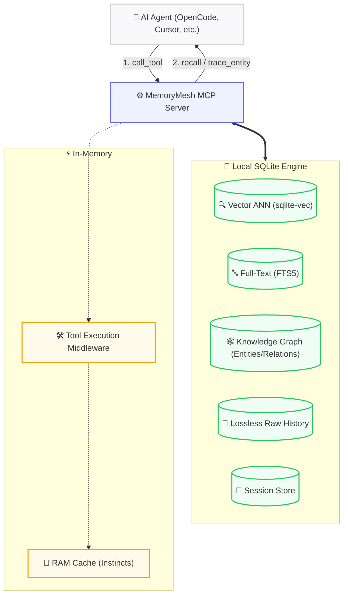

<div align="right">
  <a href="README.md">🇺🇸 English</a> | <strong>🇻🇳 Tiếng Việt</strong>
</div>

<div align="center">
  <h1>🧠 MemoryMesh</h1>
  <p><strong>A lightweight, local-first MCP memory server for long-term AI agent context, behavioral learning, and precise action control.</strong></p>
  <p>
    <a href="https://github.com/features/actions"></a>
    
    
    
    
    
  </p>
</div>
MemoryMesh is a high-performance, **local-first persistent memory MCP server** designed to give your AI agents long-term context, multi-hop reasoning, and behavioral learning — without Docker, without cloud databases, without external services.

```
┌──────────────────────────────────────────────────────────────┐
│ pip install memorymesh → python -m memorymesh init → ready   │
└──────────────────────────────────────────────────────────────┘
```

## 🧠 MemoryMesh vs Other MCP Memory Servers

| Feature | Anthropic Official | mem0 | Zep/Graphiti | **MemoryMesh** |
|---------|:-:|:-:|:-:|:-:|
| GitHub Stars | ~86K | ~52K | ~24K | **new** |
| Behavioral Learning | ❌ | ❌ | ❌ | ✅ **Instinct v2** |
| Action Choke Point | ❌ | ❌ | ❌ | ✅ |
| 3-tier Hybrid Search | ❌ | ❌ | ❌ | ✅ |
| Lossless Raw History | ❌ | ❌ | ❌ | ✅ |
| Multi-hop Knowledge Graph | ✅ | Optional (Pro $249) | ✅ | ✅ |
| Temporal Decay | ❌ | ❌ | ✅ | ✅ |
| MCP Tools | 9 | 9 (MCP archived) | 9 | **24** |
| Infrastructure | JSONL file | Qdrant (self-host) | Neo4j (self-host) | **✅ Single SQLite file** |
| Installation | npx/docker | pip + services | docker + Neo4j | **`pip install memorymesh`** |
*MemoryMesh is new. These projects have larger ecosystems and communities. We focus on features the others don't offer.*
**Who is this for?** AI agent developers (OpenCode, Cursor, Claude Code) who lose context between sessions · MCP enthusiasts wanting no cloud DBs or Docker · Privacy-conscious users needing air-gapped memory · Tool builders wanting 24 tools, not 9.
---
## 📑 Table of Contents
- [🎬 See It in Action](#see-it-in-action)
- [✨ Why MemoryMesh?](#why-memorymesh)
- [🏗 System Architecture](#system-architecture)
- [💡 The Story Behind MemoryMesh](#the-story-behind-memorymesh)
- [🚀 Quick Start & Installation](#quick-start-installation)
- [⚙️ Configuration](#configuration)
- [🧰 Available MCP Tools](#available-mcp-tools)
- [💻 CLI Usage](#cli-usage)
- [🛠 Development & Testing](#development-testing)
- [🤝 Contributing](#contributing)
- [🛡️ Security Notice](#security-notice)
- [📄 License](#license)
---
## 🎬 See It in Action
```
$ pip install memorymesh
$ python -m memorymesh init
✔ Workspace ready at ./memorymesh/
✔ MCP server configured for OpenCode
  Agent: "what was I working on last session?"
  MemoryMesh: 🔍 recall("last session context")
              → 3 memories found (knowledge + user level)
  Agent: ✅ continues seamlessly where it left off
$ memorymesh stats
🧠 Memories: 1,247 · Sessions: 34 · Entities: 89 · DB size: 4.2 MB
```
No context lost. No re-explaining. No cloud.
---
## ✨ Why MemoryMesh?
These features are unique to MemoryMesh — no other MCP memory server has them.
**🧠 Instinct v2 (Behavioral Learning)** — N-gram pattern extraction, O(1) RAM-cached regex, auto-tagging at confidence > 0.8, reinforcement scoring.

**⛓️ Action Choke Point** — Blocks `recall` after 5 uncommitted actions until `commit_milestone`. Hostage data cached, released instantly. Prevents context overflow.

**🔍 3-Tier Hybrid Search** — Vector ANN (sqlite-vec) → FTS5 keyword → chronological fallback. Level-weighted scoring with workspace-aware soft penalty.

**📜 Lossless Raw History** — Verbatim tool call logging with zlib compression. Queryable via `recall_raw` (filter by tool, success/error). No LLM summarization loss.

**🕸️ Multi-hop GraphRAG** — Recursive CTE graph traversal. Entities, relations, cycle detection. Safe for Plan/Read-Only. Export as XML triplets.

**📄 Dynamic Context Management** — Keyset cursor pagination (stateless). Scoring via SQLite CTEs (importance × level weight × recency decay). Multi-threaded token counting.

**🧩 Flexible Embedding** — `pip install memorymesh` (~50MB, no PyTorch). Optional `[local]` for SentenceTransformer offline. Remote API supported.
---
## 🏗 System Architecture
MemoryMesh relies on a single SQLite database packed with `sqlite-vec` for vector similarity, `FTS5` for keyword search, and custom schema tables for Knowledge Graphs.


### 💎 Hidden Gems (Under the Hood)
- **Zero-Latency Context (Optimistic Hydration):** Semantic anchors pre-computed before session close. AI regains context in `<5ms`.
- **3-Tier Fallback Retrieval:** 1️⃣ Semantic (sqlite-vec) → 2️⃣ FTS5 keyword → 3️⃣ Chronological scan. Prevents "amnesia hallucinations".
- **Choke Point Mechanism:** After 5+ uncommitted actions, `recall` blocked until `commit_milestone`. Prevents context overflow.

**⚡ Performance** (2021 MacBook Pro M1, 16GB RAM)
| Operation | Latency |
|-----------|---------|
| recall (ANN, 50K vectors) | <15ms p50, <40ms p99 |
| trace_entity (3-hop) | <5ms |
| remember | <8ms |
| list_memories (100 items) | <3ms |
### 📁 Project Structure
```
src/memorymesh/
├── mcp_server/          # MCP protocol: server, handlers (24 tools), tool middleware
│   ├── handlers/        # Tool execution, filters, trackers, semantic filter
│   └── server.py        # MCP lifecycle (stdio + SSE)
├── memory/              # Storage: sqlite-vec ANN, FTS5, session store, graph store, instincts
├── utils/               # Rate limiter, path sanitizer, tool middleware, schemas
├── embedder.py          # Embedding factory (local SentenceTransformer / remote API)
├── router.py            # LLM router client with circuit breaker + fallback pool
├── cli.py               # CLI commands (init, stats, sessions)
└── config.py            # 50+ env vars across 7 config dataclasses
```
---
## 💡 The Story Behind MemoryMesh

MemoryMesh was born from a common frustration: AI agents often lack true long-term memory across sessions, leading to context loss and fragmented workflows. I set out to build a lightweight, local-first MCP server that solves this without sacrificing speed or privacy. MemoryMesh is designed to be lean and easy to use, while providing sophisticated capabilities: rapid context retrieval, precise control over model behavior, autonomous learning from user interactions, and persistent, reliable context that ensures AI agents retain what matters.

---
## 🚀 Quick Start & Installation
### Prerequisites
- Python **3.12+**
- OpenAI-compatible LLM endpoint (Ollama, vLLM, OpenAI, 9Router, etc.)
### 1. Choose your installation mode:
**A. Remote Embedding Mode (Lightweight)** — ~50MB core, remote API for embeddings.
```bash
pip install memorymesh
```
**B. Local Embedding Mode (Fully Offline)** — With `sentence-transformers` (~1.5GB).
```bash
pip install "memorymesh[local]"
```
**C. With Rich CLI Tools**
```bash
pip install "memorymesh[cli]"
```
**D. For Development (run tests)**
```bash
pip install "memorymesh[test,local,cli]"
```

> 💡 Combine extras as needed: `pip install "memorymesh[local,cli]"` installs everything.

**E. Docker (Zero Embeddings)**
```bash
docker compose -f docker/docker-compose.yml up --build
```
No PyTorch, no sentence-transformers. Uses `EMBEDDING_MODE=none`. Ideal for containerized deployments.

### 2. Initialize the Workspace
```bash
python -m memorymesh init
```
This generates your `.env` file, `db/` directory, and sets up MCP configs automatically.
---
## ⚙️ Configuration
Edit the generated `.env` file in your workspace:

| Variable | Default | Description |
| :--- | :--- | :--- |
| `ROUTER_URL` | `http://127.0.0.1:20128/v1` | Your LLM endpoint URL. |
| `DEFAULT_MODEL` | `your-model` | Primary model for summarization. |
| `BACKGROUND_MODEL_POOL` | *(Empty)* | Comma-separated cheap models for background fact extraction. |
| `EMBEDDING_MODE` | `local` | `local` (sentence-transformers), `remote` (API), or `none` (zero-dependency, Docker). |
| `EMBEDDING_MODEL` | `paraphrase-multilingual...` | Local embedding model name. |
| `REMOTE_EMBEDDING_API_URL` | *(Empty)* | Endpoint for remote embeddings. |
| `REMOTE_EMBEDDING_API_KEY` | *(Empty)* | API Key for the remote embedding server. |
| `VEC_DB_PATH` | `./db/memory.db` | Location of the SQLite database. |
| `DEFAULT_USER_ID` | `your_user_id` | **Multi-agent isolation!** Set different IDs for different agents. |

### 🌐 Cross-Device Sync
Place your `db/` folder in Google Drive or Dropbox. Using the same `DEFAULT_USER_ID` on different machines synchronizes memory instantly!
---
## 🧰 Available MCP Tools
MemoryMesh exposes **24 powerful MCP tools** to the agent:

| Category | Available Tools |
| :--- | :--- |
| **🧠 Memory Operations** | `remember`, `recall`, `forget`, `archive_memory`, `unarchive_memory`, `list_memories` |
| **🕸️ Knowledge Graph** | `create_entity`, `create_relation`, `query_graph`, `trace_entity` |
| **⏳ Session Lifecycle** | `new_session`, `end_session`, `resume_session`, `delete_session`, `list_sessions`, `get_session_context`, `save_system_prompt`, `preserve_session_memories` |
| **🏗️ Workspace Mgmt** | `commit_milestone`, `save_workspace_context` |
| **🎓 Behavioral Learning**| `learn_session`, `recall_raw` |
| **🔌 Utilities** | `ping` |
---
## 💻 CLI Usage
MemoryMesh includes built-in terminal commands to inspect your databases.
```bash
# List the last 20 sessions (Status, Workspace, Timestamps)
memorymesh sessions --limit 20
# Show rich system statistics (Entities, DB size, relations)
memorymesh stats
# Initialize a new workspace
memorymesh init
# Run as SSE HTTP server (for Docker or remote access)
memorymesh serve
```
---
## 🛠 Development & Testing
Using the provided `Makefile` makes development a breeze:
```bash
# Install everything for dev
make install-all
# Run tests (579 robust tests covering all features)
make test
make test-unit
make test-int
# Linter and Type Checking
make lint
make typecheck
# Clean artifacts
make clean
```
### Rebuild Vector Index Manually
```bash
python scripts/rebuild_vec.py
```
---
## 🤝 Contributing
We welcome contributions! Here's how to get started:
1. Fork the repo
2. Run `make install-all` for dev setup
3. Make your changes
4. Run `make test` (579 tests should pass)
5. Submit a PR

See [CONTRIBUTING.md](CONTRIBUTING.md) for detailed guidelines (coming soon).
---
## 🛡️ Security Notice
> [!CAUTION]
> **CRITICAL DATA EXPOSURE RISK**
> MemoryMesh stores **all data as plaintext** in local SQLite databases (inside `./db/`).
> **Never commit `./db/` or `.env` to a public repository!** Always add to `.gitignore`.
---
## 📄 License

MIT License © MemoryMesh
