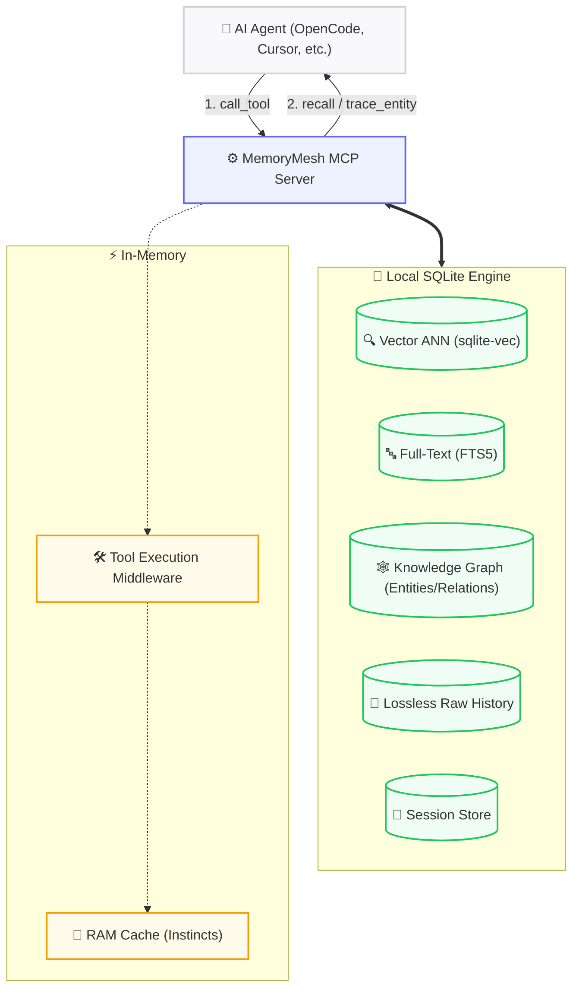

<div align="right">
  <strong>🇺🇸 English</strong> | <a href="README.vi.md">🇻🇳 Tiếng Việt</a>
</div>

<div align="center">
  <h1>🧠 MemoryMesh</h1>
  <p><strong>Local-first persistent memory MCP server for AI agents.</strong></p>

  <p>
    <a href="https://github.com/features/actions"></a>
    
    
    
    
  </p>
</div>

MemoryMesh is a high-performance, **local-first persistent memory MCP server** designed to give your AI agents long-term context, multi-hop reasoning, and behavioral learning capabilities without relying on external cloud databases.

---

## 📑 Table of Contents

- [✨ What's New in v0.5.0](#-whats-new-in-v050)
- [🏗 System Architecture](#-system-architecture)
- [🚀 Quick Start & Installation](#-quick-start--installation)
- [⚙️ Configuration](#️-configuration)
- [🧰 Available MCP Tools](#-available-mcp-tools)
- [💻 CLI Usage](#-cli-usage)
- [🛠 Development & Testing](#-development--testing)
- [🛡️ Security Notice](#️-security-notice)
- [📄 License](#-license)

---

## ✨ What's New in v0.5.0

Version 0.5.0 is a massive leap forward, introducing GraphRAG, behavioral learning, and rock-solid context management.

| Feature | Description |
| :--- | :--- |
| **🧠 Knowledge Graph (GraphRAG)** | Native SQLite entities/relations with `trace_entity`, `query_graph`, `create_entity`. Recursive CTE for multi-hop reasoning. Safe for Plan/Read-Only modes. |
| **🤖 Instinct v2 (Behavioral Learning)** | RAM cache with pre-compiled regex for O(1) matching. Extracts N-gram workflow patterns. Auto-applies tags when confidence > 0.8. |
| **📜 Lossless Raw History** | Verbatim tool call logging with zlib compression via `AsyncBatchLogger`. Query with `recall_raw` — no more context lost to summarization. |
| **⚡ Lifecycle Automation** | Compressed Context Delta (<800 tokens) on auto-recall. Lazy summarization (Orphan Recovery) for missing milestones. 15-minute idle watchdog. |
| **📄 Dynamic Context Mgmt** | Stateless keyset (cursor) pagination. Dynamic scoring pushed directly into SQLite CTEs. Multi-threaded token counting. |
| **🔧 Flexible Embedding** | Lightweight core via `pip install memorymesh` (no PyTorch). Optional `[local]` flag for `SentenceTransformer` local offloading. |

---

## 🏗 System Architecture

MemoryMesh relies on a single SQLite database packed with `sqlite-vec` for vector similarity, `FTS5` for keyword search, and custom schema tables for Knowledge Graphs. 



### 💎 Hidden Gems (Under the Hood)
- **Zero-Latency Context (Optimistic Hydration):** Semantic anchors are pre-computed before session close. AI regains context in `<5ms`.
- **3-Tier Fallback Retrieval:** 1️⃣ Semantic (sqlite-vec) → 2️⃣ FTS5 keyword → 3️⃣ Chronological scan. Prevents "amnesia hallucinations".
- **Choke Point Mechanism:** After 5+ uncommitted actions, `recall` is blocked until `commit_milestone` is called. Prevents context overflow.

---

## 🚀 Quick Start & Installation

### Prerequisites
- Python **3.12+**
- OpenAI-compatible LLM endpoint (Ollama, vLLM, OpenAI, 9Router, etc.)

### 1. Choose your installation mode:

**A. Remote Embedding Mode (Lightweight)**
Core is ~50MB. Requires a remote API for embeddings.
```bash
pip install memorymesh
```

**B. Local Embedding Mode (Fully Offline)**
Includes `sentence-transformers` (~1.5GB). Completely private and offline.
```bash
pip install "memorymesh[local]"
```

**C. With Rich CLI Tools**
```bash
pip install "memorymesh[cli]"
# Or install everything: pip install "memorymesh[local,cli]"
```

### 2. Initialize the Workspace
```bash
python -m memorymesh init
```
This generates your `.env` file, `db/` directory, and sets up MCP configs automatically.

---

## ⚙️ Configuration

Edit the generated `.env` file in your workspace:

| Variable | Default | Description |
| :--- | :--- | :--- |
| `ROUTER_URL` | `http://127.0.0.1:20128/v1` | Your LLM endpoint URL. |
| `DEFAULT_MODEL` | `your-model` | Primary model for summarization. |
| `BACKGROUND_MODEL_POOL` | *(Empty)* | Comma-separated list of cheap models used for background fact extraction. |
| `EMBEDDING_MODE` | `local` | Set to `remote` to use an API for embeddings. |
| `EMBEDDING_MODEL` | `paraphrase-multilingual...` | Local embedding model name. |
| `REMOTE_EMBEDDING_API_URL` | *(Empty)* | Endpoint for remote embeddings. |
| `REMOTE_EMBEDDING_API_KEY` | *(Empty)* | API Key for the remote embedding server. |
| `VEC_DB_PATH` | `./db/memory.db` | Location of the SQLite database. |
| `DEFAULT_USER_ID` | `your_user_id` | **Multi-agent isolation!** Set different IDs for different agents (e.g. `opencode-agent`, `cursor-agent`). |

### 🌐 Cross-Device Sync
Place your `db/` folder in Google Drive or Dropbox. Using the same `DEFAULT_USER_ID` on different machines synchronizes the agent's memory instantly!

---

## 🧰 Available MCP Tools

MemoryMesh exposes **22 powerful MCP tools** to the agent:

| Category | Available Tools |
| :--- | :--- |
| **🧠 Memory Operations** | `remember`, `recall`, `forget`, `archive_memory`, `unarchive_memory`, `list_memories` |
| **🕸️ Knowledge Graph** | `create_entity`, `create_relation`, `query_graph`, `trace_entity` |
| **⏳ Session Lifecycle** | `new_session`, `end_session`, `resume_session`, `delete_session`, `list_sessions`, `get_session_context`, `save_system_prompt`, `preserve_session_memories` |
| **🏗️ Workspace Mgmt** | `commit_milestone`, `save_workspace_context` |
| **🎓 Behavioral Learning**| `learn_session`, `recall_raw` |
| **🔌 Utilities** | `ping` |

---

## 💻 CLI Usage

MemoryMesh includes built-in terminal commands to inspect your databases.

```bash
# List the last 20 sessions (Status, Workspace, Timestamps)
memorymesh sessions --limit 20

# Show rich system statistics (Entities, DB size, relations)
memorymesh stats

# Initialize a new workspace
memorymesh init
```

---

## 🛠 Development & Testing

Using the provided `Makefile` makes development a breeze:

```bash
# Install everything for dev
make install-all

# Run tests (281+ robust tests covering all features)
make test
make test-unit
make test-int

# Linter and Type Checking
make lint
make typecheck

# Clean artifacts
make clean
```

### Rebuild Vector Index Manually
```bash
python scripts/rebuild_vec.py
```

---

## 🛡️ Security Notice

> [!CAUTION]
> **CRITICAL DATA EXPOSURE RISK**
>
> MemoryMesh stores **all data as plaintext** in local SQLite databases (inside the `./db/` directory). 
> **Never commit the `./db/` directory or your `.env` file to a public repository!** Always add them to `.gitignore`.

---

## 📄 License

MIT License © MemoryMesh
