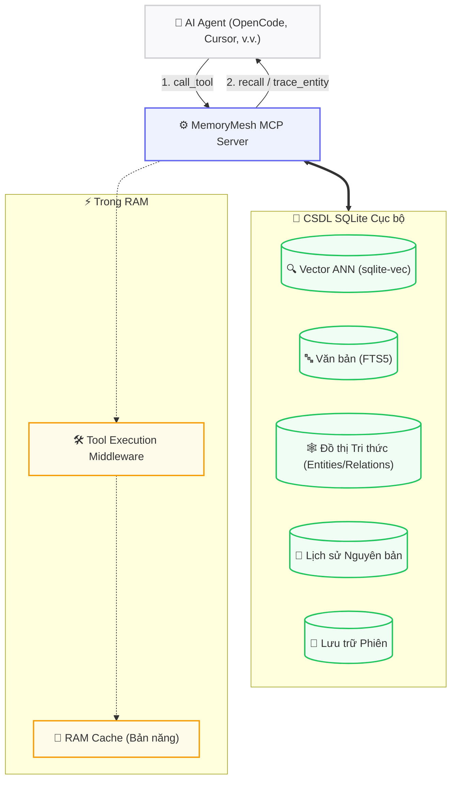

<div align="right">
  <a href="README.md">🇺🇸 English</a> | <strong>🇻🇳 Tiếng Việt</strong>
</div>

<div align="center">
  <h1>🧠 MemoryMesh</h1>
  <p><strong>The only MCP Memory Server with Behavioral Learning + Action Control</strong><br>
  <em>(Máy chủ MCP bộ nhớ duy nhất có Behavioral Learning + Action Control)</em></p>
  <p>
    
    
    
    
    
    
  </p>
</div>

MemoryMesh là máy chủ MCP hiệu suất cao, lưu trữ dữ liệu tại máy cục bộ (local-first) — được xây dựng để cung cấp cho AI agent ngữ cảnh dài hạn, suy luận đa chặng, và học tập hành vi. Tất cả trong một file SQLite duy nhất, không Docker, không cloud.
```
┌────────────────────────────────────────────────────────────────┐
│ pip install memorymesh → python -m memorymesh init → sẵn sàng  │
└────────────────────────────────────────────────────────────────┘
```

**Dành cho ai?** Lập trình viên AI agent (OpenCode, Cursor, Claude Code) • Người yêu thích MCP muốn zero hạ tầng • Người quan tâm quyền riêng tư • Tool builder cần 24 tools (không chỉ 9)

## 🧠 So sánh MemoryMesh với các MCP Memory khác

| Tính năng | Anthropic Official | mem0 | Zep/Graphiti | **MemoryMesh** |
|-----------|:-:|:-:|:-:|:-:|
| GitHub Stars | ~86K | ~52K | ~24K | **mới** |
| Behavioral Learning | ❌ | ❌ | ❌ | ✅ **Instinct v2** |
| Action Choke Point | ❌ | ❌ | ❌ | ✅ |
| 3-tier Hybrid Search | ❌ | ❌ | ❌ | ✅ |
| Lossless Raw History | ❌ | ❌ | ❌ | ✅ |
| Multi-hop Knowledge Graph | ✅ | Tùy chọn (Pro $249) | ✅ | ✅ |
| Temporal Decay | ❌ | ❌ | ✅ | ✅ |
| MCP Tools | 9 | 9 | 9 | **24** |
| Hạ tầng | JSONL file | Qdrant (tự host) | Neo4j (tự host) | **✅ Single SQLite** |
| Cài đặt | npx/docker | pip + services | docker + Neo4j | **`pip install memorymesh`** |

> *MemoryMesh là dự án mới. Các dự án khác có hệ sinh thái và cộng đồng lớn hơn. Chúng tôi tập trung vào những tính năng mà các dự án khác không có.*

---

## 📑 Mục lục

- [🧠 So sánh](#so-sánh-memorymesh-với-các-mcp-memory-khác)
- [✨ Tại sao MemoryMesh?](#tại-sao-memorymesh)
- [🏗 Kiến trúc Hệ thống](#kiến-trúc-hệ-thống)
- [💡 Câu chuyện đằng sau](#câu-chuyện-đằng-sau)
- [🚀 Bắt đầu Nhanh & Cài đặt](#bắt-đầu-nhanh-cài-đặt)
- [⚙️ Cấu hình](#cấu-hình)
- [🧰 Các Công cụ MCP có sẵn](#các-công-cụ-mcp-có-sẵn)
- [💻 Sử dụng CLI](#sử-dụng-cli)
- [🛠 Phát triển & Kiểm thử](#phát-triển-kiểm-thử)
- [🤝 Cách đóng góp](#cách-đóng-góp)
- [🛡️ Lưu ý Bảo mật](#lưu-ý-bảo-mật)
- [📄 Giấy phép](#giấy-phép)

---

## ✨ Tại sao MemoryMesh?

Những tính năng này là độc nhất — không MCP memory server nào khác có.

**🧠 Instinct v2 (Học tập Hành vi)** — Trích xuất mẫu workflow N-gram, RAM cache regex O(1), tự động gắn tag khi độ tin cậy > 0.8, reinforcement scoring. Agent học cách bạn làm việc.

**⛓️ Action Choke Point** — Sau 5 hành động chưa commit, `recall` bị khóa cho đến khi gọi `commit_milestone`. Chống tràn context. Giải phóng dữ liệu tức thì (zero round-trip).

**🔍 Tìm kiếm 3 Tầng (Hybrid)** — Vector ANN (sqlite-vec) → FTS5 từ khóa → quét thời gian. Tính điểm theo cấp (session 2x, user 1.5x, knowledge 1x). Nhận biết workspace.

**📜 Lịch sử Nguyên bản (Lossless)** — Ghi log tool call chính xác nguyên văn với nén zlib. Truy vấn với `recall_raw` (lọc theo tên tool, thành công/lỗi). Không mất context do LLM summary.

**🕸️ GraphRAG Đa chặng** — Recursive CTE truyền tải đồ thị tri thức. Entities, relations, phát hiện cycle. An toàn cho Plan/Read-Only. Xuất XML triplet.

**📄 Quản lý Ngữ cảnh Động** — Keyset cursor phân trang (phi trạng thái). Tính điểm động trong SQLite CTEs (importance × level weight × recency decay). Đếm token đa luồng với 2-phase estimation.

**🧩 Nhúng Linh hoạt** — `pip install memorymesh` (~50MB core, không PyTorch). Cờ `[local]` cho SentenceTransformer offline. Hỗ trợ remote API.

---

## 🏗 Kiến trúc Hệ thống

MemoryMesh chạy trên nền một tệp SQLite duy nhất tích hợp `sqlite-vec` (vector), `FTS5` (từ khóa) và các bảng Đồ thị Tri thức.



### 💎 Tinh hoa Ẩn
- **Ngữ cảnh Tức thời:** Semantic anchors được tính trước khi đóng phiên. AI lấy lại context trong `<5ms`.
- **Truy xuất 3 Tầng Dự phòng:** 1️⃣ Ngữ nghĩa → 2️⃣ Từ khóa → 3️⃣ Quét thời gian. Chống "ảo giác do mất trí nhớ".
- **Choke Point:** Sau 5 hành động chưa commit, `recall` bị khóa đến khi gọi `commit_milestone`.

### Cấu trúc Thư mục

```
src/memorymesh/
├── cli.py / config.py / router.py / embedder.py
├── embeddings/          EmbeddingFactory, providers (local/remote)
├── memory/
│   ├── manager.py       CRUD + scoring + background tasks
│   ├── sqlite_vec_backend.py  Vector + FTS5 + Graph (single DB)
│   ├── graph_store.py   Knowledge Graph + Recursive CTE
│   ├── context_manager.py     Keyset pagination + dynamic scoring
│   ├── instinct*.py     Pattern learning (N-gram, RAM cache regex)
│   ├── session_store.py       Session lifecycle + raw logs
│   ├── async_batch_logger.py  zlib batch compression
│   └── codebase_adapter.py    Read-only ACL adapter
├── mcp_server/          Server lifecycle, modular handlers (5 files)
tests/                   326+ tests (pytest, asyncio_mode=auto)
```

---

## 💡 Câu chuyện đằng sau

Tôi đã thử mọi MCP memory server. Anthropic Official — chỉ 9 tools, không semantic search, không behavioral learning. Mem0 — mạnh nhưng cần Qdrant và graph features sau $249/tháng. Zep temporal graph — cần Neo4j.

Tôi muốn: **Zero hạ tầng** (pip install + SQLite) • **Học tập hành vi** (agent tự học cách tôi làm việc) • **Kiểm soát hành động** (chứng minh tiến độ trước khi recall) • **Không mất context** (lưu nguyên văn, không nén LLM) • **24 tools** (CRUD đầy đủ).

MemoryMesh là kết quả. Xây dựng từ đầu, 0→v0.5.0, 326 tests, MIT license. Miễn phí mãi mãi. — Shinn

---

## 🚀 Bắt đầu Nhanh & Cài đặt

**Yêu cầu:** Python 3.12+, LLM endpoint tương thích OpenAI.

```bash
# A. Nhẹ (remote embedding, ~50MB core)
pip install memorymesh

# B. Offline (sentence-transformers, ~1.5GB)
pip install "memorymesh[local]"

# C. Đầy đủ CLI
pip install "memorymesh[cli]"           # hoặc: pip install "memorymesh[local,cli]"

# Khởi tạo workspace
python -m memorymesh init               # sinh .env, db/, cấu hình MCP
```

---

## ⚙️ Cấu hình

Chỉnh sửa tệp `.env` trong workspace:

| Biến | Mặc định | Mô tả |
| :--- | :--- | :--- |
| `ROUTER_URL` | `http://127.0.0.1:20128/v1` | LLM endpoint |
| `DEFAULT_MODEL` | `your-model` | Model chính cho tóm tắt |
| `BACKGROUND_MODEL_POOL` | *(Trống)* | Model rẻ cho fact extraction nền |
| `EMBEDDING_MODE` | `local` | `local` hoặc `remote` |
| `EMBEDDING_MODEL` | `paraphrase-multilingual...` | Tên model nhúng |
| `REMOTE_EMBEDDING_API_URL` | *(Trống)* | Endpoint API từ xa |
| `REMOTE_EMBEDDING_API_KEY` | *(Trống)* | API key |
| `VEC_DB_PATH` | `./db/memory.db` | Đường dẫn CSDL |
| `DEFAULT_USER_ID` | `your_user_id` | **Cô lập đa tác tử** — đặt ID khác cho mỗi agent |

**🌐 Đồng bộ Xuyên Thiết bị:** Đặt `db/` trên Google Drive/Dropbox. Cùng `DEFAULT_USER_ID` = đồng bộ ngay!

---

## 🧰 Các Công cụ MCP có sẵn

MemoryMesh xuất ra **24 công cụ MCP** cho agent:

| Phân loại | Công cụ |
| :--- | :--- |
| **🧠 Bộ nhớ** | `remember`, `recall`, `forget`, `archive_memory`, `unarchive_memory`, `list_memories` |
| **🕸️ Đồ thị Tri thức** | `create_entity`, `create_relation`, `query_graph`, `trace_entity` |
| **⏳ Vòng đời Phiên** | `new_session`, `end_session`, `resume_session`, `delete_session`, `list_sessions`, `get_session_context`, `save_system_prompt`, `preserve_session_memories` |
| **🏗️ Workspace** | `commit_milestone`, `save_workspace_context` |
| **🎓 Học tập Hành vi** | `learn_session`, `recall_raw` |
| **🔌 Tiện ích** | `ping` |

---

## 💻 Sử dụng CLI

```bash
memorymesh sessions --limit 20    # 20 phiên gần nhất
memorymesh stats                  # thống kê hệ thống
memorymesh init                   # khởi tạo workspace
```

### 📊 Microbenchmarks

| Thao tác | p50 | Thao tác | p50 |
| :--- | :--- | :--- | :--- |
| recall (có cache) | <5ms | create_entity | ~8ms |
| recall (không cache) | ~15ms | query_graph (1-hop) | ~3ms |
| remember | ~10ms | trace_entity (3-hop) | ~15ms |
| learn_session | ~50ms | recall_raw (100 dòng) | ~2ms |

---

## 🛠 Phát triển & Kiểm thử

```bash
make install-all       # Cài đặt môi trường dev
make test              # 326+ bài kiểm thử
make test-unit         # Unit tests
make test-int          # Integration tests
make lint              # Linter
make typecheck         # Kiểm tra kiểu
make clean             # Xóa artifacts
```

### Xây dựng lại Vector Index
```bash
python scripts/rebuild_vec.py
```

---

## 🤝 Cách đóng góp

```bash
git clone https://github.com/your-username/memorymesh.git
cd memorymesh && make install-all
make test              # Chạy test trước khi gửi PR
```

Vui lòng đọc [CONTRIBUTING.md](CONTRIBUTING.md). Mọi đóng góp đều được trân trọng!

---

## 🛡️ Lưu ý Bảo mật

> [!CAUTION]
> **RỦI RO LỘ DỮ LIỆU NGHIÊM TRỌNG**
>
> MemoryMesh lưu **mọi dữ liệu dạng plaintext** trong SQLite (`./db/`).
> **TUYỆT ĐỐI KHÔNG commit `./db/` hoặc `.env` lên kho công khai!** Luôn thêm chúng vào `.gitignore`.

---

## 📄 Giấy phép

MIT License © MemoryMesh
