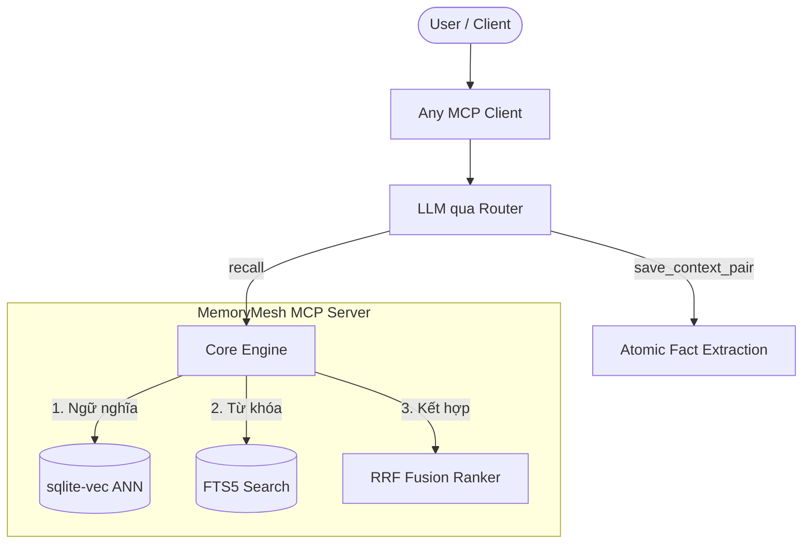

<p align="center">
  <a href="README.md"></a>
  <a href="README.vi.md"></a>
</p>

# MemoryMesh

<p align="center">
  
  
  
  
</p>

**Máy chủ MCP bộ nhớ bền vững (persistent memory), ưu tiên máy cục bộ (local-first) cho các AI agent.**
Tìm kiếm kết hợp (vector + FTS5) trong một cơ sở dữ liệu SQLite duy nhất, truy xuất xuyên phiên (cross-session recall) qua các công cụ MCP.

## Quick Start

```bash
# Clone & vào thư mục
git clone https://github.com/staavanothanh/MemoryMesh.git
cd MemoryMesh

# Tạo venv & cài đặt
python -m venv .venv
source .venv/bin/activate        # Linux/macOS
# .venv\Scripts\activate         # Windows

pip install -e ".[test]"         # cài đặt kèm test deps
python -m memorymesh init         # thiết lập một lệnh (tạo .env, cấu hình MCP)

# Khởi động OpenCode — MCP server tự động khởi chạy
opencode
```

Hoặc từng bước:

```bash
pip install -e ".[test]"
cp .env.example .env             # cấu hình endpoint LLM của bạn
python -m memorymesh             # khởi động MCP server độc lập
```

> [!NOTE]
> Ở lần chạy đầu tiên, MemoryMesh sẽ tự động tải mô hình nhúng `sentence-transformers` (~100–300 MB) vào bộ nhớ đệm cục bộ. Quá trình này có thể mất 1–2 phút tùy thuộc vào kết nối mạng của bạn.

## Kiến trúc



**Thiết kế chính:**
- Ngữ cảnh phiên bắt đầu trống; LLM gọi `recall` theo yêu cầu (dynamic recall)
- Một DB SQLite duy nhất với sqlite-vec cho tìm kiếm vector + FTS5 cho từ khóa
- Các tác vụ nền (enrichment, consolidation, trích xuất sự kiện) được giới hạn tốc độ
- Ký ức cấp phiên tự động hết hạn sau 7 ngày

### Tinh hoa ẩn (Hidden Gems)

MemoryMesh chứa đựng những quyết định kiến trúc tinh tế được thiết kế để AI hoạt động như một đồng nghiệp con người:

- **Ngữ cảnh tức thời (Optimistic Hydration):** Thay vì bắt bạn đợi tìm kiếm vector khi mở lại dự án cũ, MemoryMesh tính toán trước các "mỏ neo ngữ nghĩa" (semantic anchors) ngay trước khi phiên làm việc kết thúc. Chúng được lưu trong RAM Cache, giúp AI lấy lại toàn bộ ngữ cảnh của phiên trước trong `<5ms` — trước cả khi bạn gõ xong câu lệnh đầu tiên.
- **Trí tuệ xuyên dự án (Soft Penalty):** MemoryMesh không dùng ranh giới cứng giữa các dự án. Nó dùng cơ chế *Soft Penalty* (phạt mềm). Nếu bạn sửa một bug Docker phức tạp trong `Dự án A` và sau đó hỏi về Docker trong `Dự án B`, MemoryMesh phạt nhẹ ký ức của `Dự án A` nhưng vẫn hiển thị chúng nếu có liên quan cao. AI học toàn cục nhưng ưu tiên cục bộ.
- **Truy xuất 3 tầng dự phòng:** Cơ sở dữ liệu vector rất giỏi về ngữ nghĩa nhưng rất kém trong việc tìm tên biến hay UUID cụ thể. MemoryMesh không chỉ dựa vào vector. Nó xếp tầng qua 3 lớp:
  1. *Tìm kiếm ngữ nghĩa* (sqlite-vec)
  2. *Tìm kiếm toàn văn* (FTS5 keyword matching)
  3. *Quét thời gian* (nhật ký gần đây)
  Điều này đảm bảo không có "ảo giác do mất trí nhớ" — nếu dữ liệu tồn tại, nó sẽ được tìm thấy.

## Quản lý Chi phí & Kiến trúc Hai-LLM

MemoryMesh sử dụng **hai tầng LLM độc lập** để tách biệt hiệu suất tương tác khỏi chi phí nền:

| Tầng | Biến môi trường | Model điển hình | Mục đích |
|------|-----------------|-----------------|----------|
| **Foreground (Chat)** | `DEFAULT_MODEL` / `FALLBACK_MODEL` | GPT-5.5, Claude 4.7 Opus, Gemini 3.5 Flash, DeepSeek V4-Pro | Tương tác trực tiếp với người dùng qua MCP client |
| **Background (Dữ liệu)** | `BACKGROUND_MODEL_POOL` | Gemini 2.5 Flash, Llama 3.1 8B, DeepSeek V4 Flash | Snapshot bootstrap, trích xuất sự kiện nguyên tử, nén phiên |

### Cách hoạt động
- **Model chat chính** xử lý mọi suy luận hướng đến người dùng — chọn model tốt nhất bạn có thể chi trả.
- **Tác vụ nền** (trích xuất sự kiện, tạo snapshot, nén) chạy trên một nhóm model *miễn phí hoặc giá rẻ* riêng được định nghĩa trong `BACKGROUND_MODEL_POOL`. Nhóm này dùng **chiến lược xếp tầng (cascade)**: nếu model đầu tiên thất bại, nó tự động thử model tiếp theo trong danh sách.
- Nếu `BACKGROUND_MODEL_POOL` trống, các tác vụ nền sẽ dự phòng về model chat chính.

### Chế độ Kinh tế (Economy Mode)
Đặt `AUTO_EXTRACT_FACTS=false` trong file `.env` của bạn để tắt hoàn toàn việc trích xuất sự kiện nguyên tử tự động. Điều này loại bỏ các cuộc gọi LLM nền (chi phí token bằng không) trong khi vẫn giữ kho lưu trữ mạch tường thuật (narrative-thread) và truy xuất xuyên phiên hoạt động đầy đủ.

## Đa Agent & Đồng bộ Xuyên Thiết bị

MemoryMesh được thiết kế với kiến trúc sẵn sàng cho tương lai xoay quanh biến môi trường `DEFAULT_USER_ID`. Điều này mở ra những quy trình làm việc thực tế mạnh mẽ:

### 1. Chia sẻ Đa Agent
Nếu bạn dùng nhiều trợ lý AI (ví dụ: OpenCode, Cline, Cursor) trên cùng một máy, chúng có thể:
- **Chia sẻ ký ức:** Trỏ tất cả về cùng `VEC_DB_PATH` và dùng chung `DEFAULT_USER_ID`. Chúng sẽ hoạt động như một bộ não tập thể, chia sẻ ngữ cảnh liền mạch.
- **Cô lập ký ức:** Giữ cùng database nhưng đặt `DEFAULT_USER_ID=opencode` cho một agent và `DEFAULT_USER_ID=cline` cho agent kia. Chúng dùng chung file vật lý nhưng hoàn toàn cách ly về mặt tư duy.

### 2. Phân tách Vai trò / Cá tính
Là một lập trình viên, bạn có thể có nhiều vai trò khác nhau. Bạn có thể cô lập ngữ cảnh mà không cần chạy nhiều database:
- Đặt `DEFAULT_USER_ID=work_profile` cho dự án công ty (giữ các quy ước doanh nghiệp được cô lập nghiêm ngặt).
- Đặt `DEFAULT_USER_ID=personal_profile` cho các dự án cá nhân cuối tuần.

### 3. Đồng bộ Xuyên Thiết bị
Vì MemoryMesh dùng một cơ sở dữ liệu SQLite đơn, di động, bạn có thể đặt thư mục `db/` vào Google Drive, Dropbox, hoặc ổ mạng.
Bằng cách đặt cùng `DEFAULT_USER_ID` trên laptop công ty và máy tính ở nhà, các AI agent của bạn sẽ đồng bộ trạng thái bộ nhớ xuyên suốt các máy vật lý một cách liền mạch.

## Thiết lập

### Yêu cầu
- Python **3.12+**
- Một endpoint LLM tương thích OpenAI (Ollama, vLLM, OpenAI, 9Router, v.v.)

### Môi trường

Sao chép `.env.example` thành `.env` và chỉnh sửa:

```bash
cp .env.example .env
```

| Biến môi trường | Mặc định | Mô tả |
|-----------------|----------|-------|
| `ROUTER_URL` | `http://127.0.0.1:20128/v1` | Endpoint LLM |
| `DEFAULT_MODEL` | `your-model` | Model LLM chính |
| `BACKGROUND_MODEL_POOL` | — | Danh sách model miễn phí/rẻ cách nhau bằng dấu phẩy cho tác vụ nền |
| `EMBEDDING_MODEL` | `paraphrase-multilingual-MiniLM-L12-v2` | Model nhúng (embedding) |
| `VEC_DB_PATH` | `./db/memory.db` | Đường dẫn cơ sở dữ liệu SQLite |
| `AUTO_EXTRACT_FACTS` | `true` | Đặt thành `false` để tắt trích xuất sự kiện tự động (Economy Mode) |
| `DEFAULT_USER_ID` | `your_user_id` | Người dùng mặc định |
| `MCP_TRANSPORT` | `stdio` | `stdio` hoặc `sse` |
| `MCP_PORT` | `8090` | Cổng SSE |

### Sử dụng với CLI Agent

MemoryMesh là một **máy chủ MCP** — tương thích với mọi MCP client.
MemoryMesh **Zero-Config cho AI Agent** — mọi hướng dẫn vận hành đều được nhúng sẵn trong phần mô tả công cụ MCP (không cần file hướng dẫn riêng):

| Agent | Thiết lập |
|-------|-----------|
| **OpenCode** | `python -m memorymesh init` tự động tạo `.opencode/opencode.json`. Mọi hướng dẫn đã nằm trong description của MCP tools. Chỉ cần chạy `opencode`. |
| **Claude Code** | Thêm MCP server vào cấu hình Claude Code |
| **Cursor** | Thêm MCP server trong Cursor settings |
| **Continue.dev** | Thêm MCP server trong `~/.continue/config.json` |
| **Cline / Roo Code** | Thêm MCP server trong cài đặt extension VS Code |
| **Mọi MCP client** | `python -m memorymesh` (stdio) hoặc `http://localhost:8090` (SSE) |

### Docker

```bash
docker compose -f docker/docker-compose.yml up -d
```

## 15 Công cụ MCP

| Công cụ | Phân loại Kiến trúc | Mục đích |
|---------|---------------------|----------|
|  `remember` | Ngữ nghĩa / Vector | Lưu ký ức với nội dung, thẻ (tags), độ quan trọng |
|  `recall` | Hợp nhất RRF | Truy xuất ký ức liên quan nhất theo truy vấn ngữ nghĩa |
|  `save_context_pair` | Trích xuất Sự kiện | Lưu trao đổi hội thoại, kích hoạt trích xuất sự kiện |
|  `forget` | SQLite Bền vững | Xóa mềm (lưu trữ) một ký ức |
|  `archive_memory` | SQLite Bền vững | Di chuyển ký ức vào kho lưu trữ |
|  `unarchive_memory` | SQLite Bền vững | Khôi phục ký ức đã lưu trữ |
|  `list_memories` | SQLite Bền vững | Liệt kê ký ức chưa lưu trữ (phân trang) |
|  `save_workspace_context` | SQLite Bền vững | Chụp nhanh trạng thái workspace |
|  `new_session` | Vòng đời Phiên | Tạo phiên mới (đóng phiên hiện tại) |
|  `resume_session` | Vòng đời Phiên | Khôi phục ngữ cảnh từ phiên trước |
|  `save_system_prompt` | Vòng đời Phiên | Lưu system prompt vào phiên hiện tại |
|  `list_sessions` | Vòng đời Phiên | Liệt kê các phiên trước đây |
|  `get_session_context` | Vòng đời Phiên | Xem nhật ký ngữ cảnh phiên |
|  `end_session` | Vòng đời Phiên | Kết thúc phiên (nén + xả bộ đệm) |
|  `ping` | Tiện ích Hệ thống | Kiểm tra sức khỏe: số lượng ký ức + kết nối FTS |

## Phát triển

```bash
make install      # pip install -e ".[test]"
make test         # chạy tất cả tests
make run          # khởi động server
make clean        # xóa file tạm
```

## Cấu trúc Dự án

```
src/memorymesh/
  config.py         Cấu hình ứng dụng (dataclasses + env)
  router.py         Máy khách LLM router (retry + circuit breaker)
  embedder.py       SentenceTransformer (async thread pool)
  memory/
    manager.py      CRUD cốt lõi + tính điểm + tác vụ nền
    sqlite_vec_backend.py  DB đơn: vector + FTS5 + metadata
    consolidation.py       Gom cụm + hợp nhất + hết hạn TTL
    fact_extractor.py      Trích xuất sự kiện nguyên tử
    instinct.py            Công cụ học mẫu
    session_store.py       Vòng đời phiên
  mcp_server/
    server.py        Vòng đời máy chủ MCP
    handlers.py      Triển khai xử lý công cụ
    tools.py         Định nghĩa lược đồ công cụ
tests/
   130+ tests (pytest, asyncio_mode=auto)
```

## Thông báo Bảo mật

> [!CAUTION]
> **QUAN TRỌNG:** MemoryMesh là hệ thống ưu tiên máy cục bộ. Tất cả nhật ký hội thoại, ngữ cảnh dự án và ký ức được trích xuất đều được lưu trữ dưới dạng **văn bản thuần (plaintext)** trong cơ sở dữ liệu SQLite (`./db/`).
>
> Các file cơ sở dữ liệu này có thể chứa thông tin nhạy cảm bao gồm khóa API, đoạn mã độc quyền hoặc dữ liệu cá nhân được thảo luận trong các phiên làm việc. **Không bao giờ commit các file cơ sở dữ liệu này vào kho lưu trữ công khai.**
>
> Đảm bảo các mẫu sau được liệt kê trong file `.gitignore` của bạn (chúng đã được bao gồm theo mặc định):
> ```
> db/
> .env
> ```

## Bảo trì

### Xây dựng lại Chỉ mục Vector

Sau các thao tác cơ sở dữ liệu thủ công (ví dụ: xóa hàng loạt bằng DELETE), các chỉ mục Vector và FTS có thể bị không đồng bộ. Hãy chạy script sau để xây dựng lại toàn bộ chỉ mục:

```bash
python scripts/rebuild_vec.py
```

Script này sẽ đọc tất cả ký ức hợp lệ từ bảng `memories`, tính toán lại embedding cho từng ký ức, và tái tạo các bảng `vec_memories` và `memory_fts` từ đầu.

## Giấy phép

MIT
