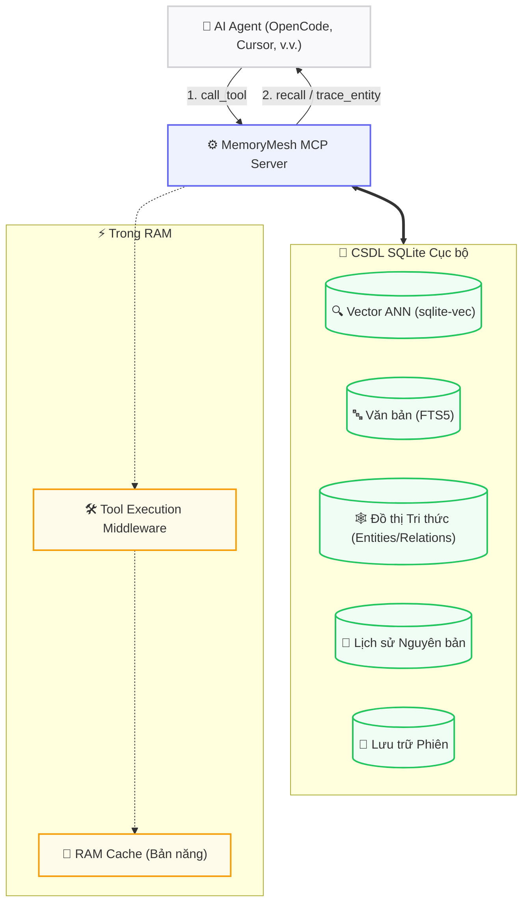

<div align="right">
  <a href="README.md">🇺🇸 English</a> | <strong>🇻🇳 Tiếng Việt</strong>
</div>

<div align="center">
  <h1>🧠 MemoryMesh</h1>
  <p><strong>Máy chủ MCP bộ nhớ bền vững (persistent memory), ưu tiên máy cục bộ (local-first) cho các AI agent.</strong></p>

  <p>
    <a href="https://github.com/features/actions"></a>
    
    
    
    
  </p>
</div>

MemoryMesh là máy chủ MCP hiệu suất cao, lưu trữ dữ liệu tại máy cục bộ (local-first) nhằm cung cấp cho các AI agent ngữ cảnh dài hạn, khả năng suy luận đa chặng, và học tập hành vi mà không cần phụ thuộc vào bất kỳ cơ sở dữ liệu đám mây (cloud databases) nào.

---

## 📑 Mục lục

- [✨ Có gì mới trong v0.5.0](#-có-gì-mới-trong-v050)
- [🏗 Kiến trúc Hệ thống](#-kiến-trúc-hệ-thống)
- [🚀 Bắt đầu Nhanh & Cài đặt](#-bắt-đầu-nhanh--cài-đặt)
- [⚙️ Cấu hình](#️-cấu-hình)
- [🧰 Các Công cụ MCP có sẵn](#-các-công-cụ-mcp-có-sẵn)
- [💻 Sử dụng CLI](#-sử-dụng-cli)
- [🛠 Phát triển & Kiểm thử](#-phát-triển--kiểm-thử)
- [🛡️ Lưu ý Bảo mật](#️-lưu-ý-bảo-mật)
- [📄 Giấy phép](#-giấy-phép)

---

## ✨ Có gì mới trong v0.5.0

Phiên bản 0.5.0 là một bước tiến vượt bậc, giới thiệu GraphRAG, học tập hành vi, và cơ chế quản lý ngữ cảnh cực kỳ vững chắc.

| Tính năng | Mô tả |
| :--- | :--- |
| **🧠 Đồ thị Tri thức (GraphRAG)** | Các thực thể/quan hệ trên SQLite thông qua `trace_entity`, `query_graph`, `create_entity`. Hỗ trợ Recursive CTE cho suy luận đa chặng. An toàn cho chế độ Plan/Read-Only. |
| **🤖 Bản năng v2 (Học tập Hành vi)** | RAM cache chứa regex được biên dịch sẵn cho tốc độ khớp O(1). Trích xuất mẫu quy trình N-gram. Tự động áp dụng tag khi độ tin cậy > 0.8. |
| **📜 Lịch sử Nguyên bản (Lossless)** | Ghi lại chính xác nguyên văn lệnh gọi công cụ với nén zlib qua `AsyncBatchLogger`. Truy vấn lại với `recall_raw` — không còn lo mất ngữ cảnh do nén tóm tắt. |
| **⚡ Tự động hóa Vòng đời** | Áp dụng Context Delta đã được nén (<800 tokens) khi tự động gọi lại. Phục hồi mốc bị thiếu (Orphan Recovery) một cách lười biếng. Tự động theo dõi trạng thái nghỉ (15 phút). |
| **📄 Quản lý Ngữ cảnh Động** | Phân trang Keyset (cursor) phi trạng thái. Thuật toán tính điểm động được đẩy trực tiếp vào SQLite CTEs. Đếm token đa luồng. |
| **🔧 Giảm tải Embedding** | Lõi siêu nhẹ với `pip install memorymesh` (không cần PyTorch). Cờ tùy chọn `[local]` giúp tính toán nhúng cục bộ qua `SentenceTransformer`. |

---

## 🏗 Kiến trúc Hệ thống

MemoryMesh chạy trên nền một tệp cơ sở dữ liệu SQLite duy nhất được tích hợp `sqlite-vec` (tìm kiếm vector), `FTS5` (tìm kiếm từ khóa) và các bảng sơ đồ tùy chỉnh cho Đồ thị Tri thức.



### 💎 Tinh hoa Ẩn (Under the Hood)
- **Ngữ cảnh Tức thời (Optimistic Hydration):** Các mỏ neo ngữ nghĩa được tính toán trước khi phiên đóng lại. AI lấy lại toàn bộ bối cảnh trong `<5ms`.
- **Truy xuất 3 Tầng Dự phòng:** 1️⃣ Ngữ nghĩa (sqlite-vec) → 2️⃣ Từ khóa FTS5 → 3️⃣ Quét theo trình tự thời gian. Ngăn chặn hiện tượng "ảo giác do mất trí nhớ".
- **Cơ chế Điểm Nghẽn (Choke Point):** Sau 5 hành động chưa commit, lệnh `recall` sẽ bị khóa tạm thời cho đến khi gọi `commit_milestone`. Chống tràn ngữ cảnh hiệu quả.

---

## 🚀 Bắt đầu Nhanh & Cài đặt

### Yêu cầu
- Python **3.12+**
- Một LLM endpoint tương thích chuẩn OpenAI (Ollama, vLLM, OpenAI, 9Router, v.v.)

### 1. Chọn chế độ cài đặt:

**A. Chế độ Nhúng Từ xa (Rất Nhẹ)**
Lõi chỉ khoảng ~50MB. Yêu cầu một API từ xa để tạo vector (embeddings).
```bash
pip install memorymesh
```

**B. Chế độ Nhúng Cục bộ (Hoàn toàn Offline)**
Bao gồm cả `sentence-transformers` (~1.5GB). Đảm bảo tính riêng tư và không cần internet.
```bash
pip install "memorymesh[local]"
```

**C. Với Công cụ CLI đầy đủ**
```bash
pip install "memorymesh[cli]"
# Hoặc cài đặt toàn bộ: pip install "memorymesh[local,cli]"
```

### 2. Khởi tạo Workspace
```bash
python -m memorymesh init
```
Lệnh này tự động sinh tệp `.env`, thư mục cơ sở dữ liệu `db/`, và tự định cấu hình MCP cho bạn.

---

## ⚙️ Cấu hình

Hãy chỉnh sửa tệp `.env` vừa sinh ra trong workspace của bạn:

| Biến | Mặc định | Mô tả |
| :--- | :--- | :--- |
| `ROUTER_URL` | `http://127.0.0.1:20128/v1` | URL của LLM endpoint. |
| `DEFAULT_MODEL` | `your-model` | Mô hình LLM chính dùng để tóm tắt. |
| `BACKGROUND_MODEL_POOL` | *(Trống)* | Danh sách các mô hình giá rẻ (cách nhau bằng dấu phẩy) dùng để trích xuất sự kiện dưới nền. |
| `EMBEDDING_MODE` | `local` | Đổi thành `remote` nếu dùng API tính toán vector. |
| `EMBEDDING_MODEL` | `paraphrase-multilingual...` | Tên của mô hình nhúng cục bộ. |
| `REMOTE_EMBEDDING_API_URL` | *(Trống)* | Endpoint cho API vector từ xa. |
| `REMOTE_EMBEDDING_API_KEY` | *(Trống)* | API key cho máy chủ vector từ xa. |
| `VEC_DB_PATH` | `./db/memory.db` | Nơi lưu trữ CSDL SQLite. |
| `DEFAULT_USER_ID` | `your_user_id` | **Cô lập đa tác tử (Multi-agent)!** Đặt ID khác nhau cho các tác tử khác nhau (ví dụ: `opencode-agent`, `cursor-agent`). |

### 🌐 Đồng bộ Xuyên Thiết bị (Cross-Device Sync)
Bạn có thể đặt thư mục `db/` trên Google Drive hoặc Dropbox. Sử dụng cùng một `DEFAULT_USER_ID` trên các thiết bị khác nhau sẽ giúp bộ nhớ của AI được đồng bộ ngay lập tức!

---

## 🧰 Các Công cụ MCP có sẵn

MemoryMesh xuất ra **22 công cụ MCP mạnh mẽ** cho agent:

| Phân loại | Công cụ |
| :--- | :--- |
| **🧠 Hoạt động Bộ nhớ** | `remember`, `recall`, `forget`, `archive_memory`, `unarchive_memory`, `list_memories` |
| **🕸️ Đồ thị Tri thức** | `create_entity`, `create_relation`, `query_graph`, `trace_entity` |
| **⏳ Vòng đời Phiên** | `new_session`, `end_session`, `resume_session`, `delete_session`, `list_sessions`, `get_session_context`, `save_system_prompt`, `preserve_session_memories` |
| **🏗️ Quản lý Workspace**| `commit_milestone`, `save_workspace_context` |
| **🎓 Học tập Hành vi** | `learn_session`, `recall_raw` |
| **🔌 Tiện ích** | `ping` |

---

## 💻 Sử dụng CLI

MemoryMesh có sẵn các lệnh dòng lệnh (terminal) để kiểm tra CSDL.

```bash
# Liệt kê 20 phiên gần nhất (Trạng thái, Workspace, Dấu thời gian)
memorymesh sessions --limit 20

# Hiển thị thống kê hệ thống đầy đủ (Thực thể, Kích thước DB, Quan hệ)
memorymesh stats

# Khởi tạo một workspace mới
memorymesh init
```

---

## 🛠 Phát triển & Kiểm thử

Việc sử dụng tệp `Makefile` giúp quy trình phát triển cực kì nhẹ nhàng:

```bash
# Cài đặt toàn bộ môi trường lập trình
make install-all

# Chạy kiểm thử (hơn 281 bài kiểm thử độ ổn định cho mọi tính năng)
make test
make test-unit
make test-int

# Chạy linter & Kiểm tra kiểu dữ liệu
make lint
make typecheck

# Xóa các tệp tạm / bộ nhớ cache
make clean
```

### Xây dựng lại Chỉ mục Vector bằng tay
```bash
python scripts/rebuild_vec.py
```

---

## 🛡️ Lưu ý Bảo mật

> [!CAUTION]
> **RỦI RO LỘ DỮ LIỆU NGHIÊM TRỌNG**
>
> MemoryMesh lưu **mọi dữ liệu ở dạng văn bản thuần (plaintext)** trong các CSDL SQLite cục bộ (bên trong thư mục `./db/`).
> **TUYỆT ĐỐI KHÔNG commit thư mục `./db/` hoặc tệp `.env` lên các kho mã nguồn công khai (như GitHub)!** Hãy luôn thêm chúng vào `.gitignore`.

---

## 📄 Giấy phép

MIT License © MemoryMesh
